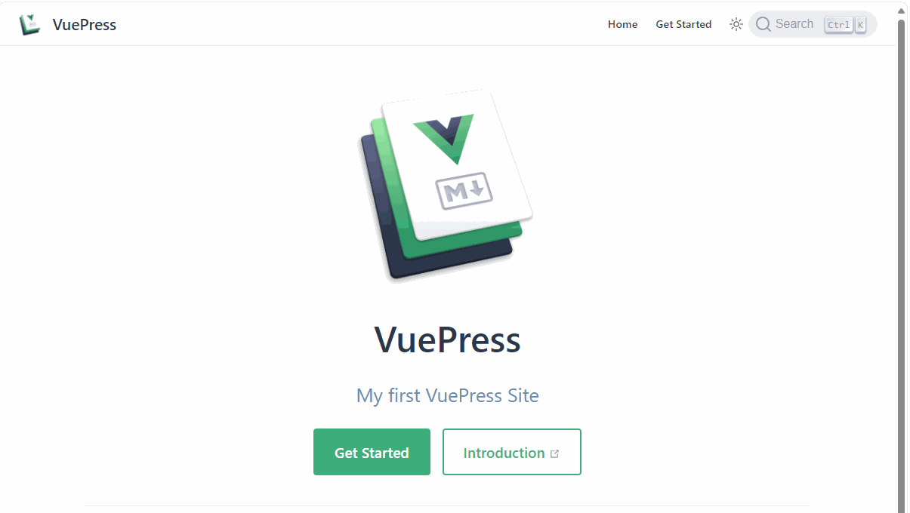

# vuepress-plugin-meilisearch2



```ts
import { defineUserConfig } from 'vuepress';
import { MeiliSearchPlugin } from 'vuepress-plugin-meilisearch2';

defineUserConfig({
  plugins: [
    MeiliSearchPlugin({
      host: '',
      apiKey: '',
      index: '',
    })
  ]
})
```

See the [documentation](https://vuepress-plugin-meilisearch2.jinqiu.wang/) for more details
